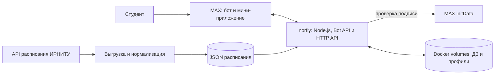

<h1 align="center">norfly</h1>

<p align="center">
  <strong>Расписание и домашние задания группы — прямо в MAX.</strong>
</p>

<p align="center">
  norfly — мини-приложение и бот для студентов ИРНИТУ. Оно связывает пару,
  аудиторию, домашнее задание и напоминание в одном привычном месте — в MAX.
</p>

<p align="center">
  <a href="https://max.ru/t692_hakaton_max_bot">
    
  </a>
  <a href="https://158-160-37-19.sslip.io">
    
  </a>
</p>

<p align="center">
  
  
  
  
</p>

<p align="center">
  <a href="#-почему-norfly">Почему</a> ·
  <a href="#-возможности">Возможности</a> ·
  <a href="#-галерея">Галерея</a> ·
  <a href="#-проверить-проект">Запуск</a> ·
  <a href="#-архитектура">Архитектура</a>
</p>

<p align="center">
  
  
</p>

## 🤔 Почему norfly

В чате группы домашнее задание быстро теряется среди сообщений, а расписание открывается отдельно. norfly собирает их в один сценарий: студент открывает нужную пару и сразу видит, что, где и к какому сроку нужно сделать.

> **Одна связка:** `пара → аудитория → домашнее задание → напоминание`.

Проект рассчитан на студентов 1–2 курсов ИРНИТУ и старост, которые собирают учебную информацию для группы. Расписание загружается из API ИРНИТУ, а ДЗ можно вести в чате группы и в мини-приложении MAX.

## 🎯 Возможности

- **Расписание на день и неделю** — группа, подгруппа, чётность недели, время, аудитория и преподаватель.
- **Текущая и ближайшая пара** — студент сразу понимает, что происходит сейчас и что будет дальше.
- **ДЗ рядом с парой** — общее задание видит вся группа в чате и приложении.
- **Личная версия ДЗ** — заметка конкретного студента не меняет общую запись.
- **Роли в групповом чате** — староста назначает редакторов и управляет доступом к ДЗ.
- **Планер и объявления** — личные задачи, сообщения старосты и напоминания настраиваются отдельно для каждого студента.
- **Контрольные** — экзамены и зачёты отображаются отдельным экраном с напоминаниями.
- **Переносы и замены** — бот замечает изменения в расписании и сообщает о новой паре, аудитории или преподавателе.
- **Напоминания об отсутствии** — студент сообщает об опоздании или пропуске, а староста получает обращение и отмечает его как принятое.
- **Профиль и приглашение** — группа, уведомления, язык RU/EN, тема интерфейса, удаление данных и ссылка для одногруппников.

## 🧭 Как это работает

1. Студент открывает бота в MAX, находит `ИСТб-25-1` и выбирает подгруппу.
2. На «Главной» видит ближайшую пару, задачи и объявления; в «Расписании» переключает день и неделю.
3. Староста или редактор выбирает пару и добавляет общее домашнее задание.
4. Студент видит ДЗ рядом с парой, сохраняет личную версию и настраивает напоминание в планере.
5. Если планы меняются, студент сообщает об опоздании или отсутствии, а староста подтверждает обращение.

## 📱 Галерея

<table align="center">
  <tr>
    <td></td>
    <td></td>
  </tr>
  <tr>
    <td></td>
    <td></td>
  </tr>
</table>

<p align="center"><sub>Интерфейс показан на демонстрационных данных: даты, имена, пары и тексты заданий не являются данными реальных студентов.</sub></p>

## 🚀 Проверить проект

1. Откройте [бота norfly в MAX](https://max.ru/t692_hakaton_max_bot) и нажмите кнопку запуска приложения.
2. Найдите группу `ИСТб-25-1` и выберите **1 подгруппу**.
3. Переключите режимы **День / Неделя**, выберите дату и откройте карточку пары.
4. Для группового сценария добавьте бота администратором в чат, выполните `/setup`, назначьте старосту командой `/headman` в ответ на его сообщение и используйте `/homework_create`.

Расписание берётся из API ИРНИТУ. Записи ДЗ в тестовой группе появляются, когда их добавят пользователи.

## 💬 Команды MAX

| Сценарий | Команда |
|---|---|
| Расписание на сегодня, завтра или неделю | `/today`, `/tomorrow`, `/week` |
| ДЗ и личная версия задания | `/homework`, `/add` |
| Объявления старосты | `/news` |
| Сообщить об опоздании или отсутствии | `/absence` |
| Найти группу, преподавателя или аудиторию | `/find` |
| Настройки, язык и мои данные | `/settings` |
| Привязать чат к учебной группе | `/setup` |
| Управление группой и ролями | `/manage`, `/headman`, `/editor`, `/team`, `/access` |
| Справка и язык чата | `/help`, `/language` |

## 🧩 Архитектура



## 🧰 Технологии

| Часть | Технологии | Назначение |
|---|---|---|
| Бот и API | Node.js, `@maxhub/max-bot-api` | Команды в личном и групповом чате, HTTP API, проверка `initData` |
| Мини-приложение | React 19, TypeScript, `@maxhub/max-ui`, Vite | Поиск группы, расписание, карточка пары и ДЗ |
| Интеграция с MAX | MAX Bridge | Запуск из чата, навигация и действия Mini App |
| Источник расписания | API ИРНИТУ | Группы, преподаватели, аудитории и пары |
| Развёртывание | Docker Compose, Yandex Cloud | Бот, приложение и API на одном сервере; данные в Docker volumes |

Контракт API описан в [`openapi.yaml`](openapi.yaml), требования к данным — в [`DATA-API.yaml`](DATA-API.yaml).

## 🛠️ Локальный запуск

Нужны Node.js 20+ и Docker Compose v2.

```bash
cp .env.example .env
```

Заполните в `.env` `BOT_TOKEN` и `IRNITU_API_TOKEN`, затем выполните:

```bash
docker compose up --build
```

Мини-приложение будет доступно на `http://localhost:3000`, проверка состояния API — `http://localhost:3000/health`.

Для разработки интерфейса без запуска бота:

```bash
npm ci
npm ci --prefix webapp
npm run dev:web
```

## 🔐 Данные и ограничения MVP

- Расписание загружается из API ИРНИТУ: ближайшие две недели обновляются раз в три часа, полное расписание семестра — раз в неделю.
- Общее ДЗ хранится для учебной группы, личное — отдельно для пользователя. API проверяет подпись `initData` MAX.
- Объявления старосты и сообщения об опозданиях хранятся в данных группы; студент может удалить свой профиль, настройки, личное ДЗ и напоминания.
- Токены находятся только в серверном `.env`; телефоны и сведения о здоровье не собираются.
- ДЗ ограничено 2 000 символами; файлы и фотографии пока нельзя прикрепить.
- Время пар и уведомлений считается по Иркутску (UTC+8); бот и приложение поддерживают русский и английский языки.
- Для одного токена бота должен работать один экземпляр процесса.

## 🧪 План пилота

Дальнейший этап — шестинедельный пилот в группах ИРНИТУ. Целевые пороги ниже — **гипотезы для проверки, а не достигнутые результаты**:

- не менее 60% подключённых групп назначают старосту в первую неделю;
- не менее 50% пар получают запись ДЗ;
- не менее 70% студентов подключённой группы открывают бота или приложение раз в неделю.

## 👥 Команда

<table align="center">
  <tr>
    <td align="center" width="33%">
      <br>
      <strong>Дмитрий Гавриленко</strong><br>
      <sub>Продукт</sub>
    </td>
    <td align="center" width="33%">
      <br>
      <strong>Дмитрий Иванов</strong><br>
      <sub>Frontend и backend</sub>
    </td>
    <td align="center" width="33%">
      <br>
      <strong>Вячеслав Какалевский</strong><br>
      <sub>UX/UI</sub>
    </td>
  </tr>
</table>

---

<p align="center"><sub>norfly · Хакатон MAX 2026 · образовательные решения</sub></p>
