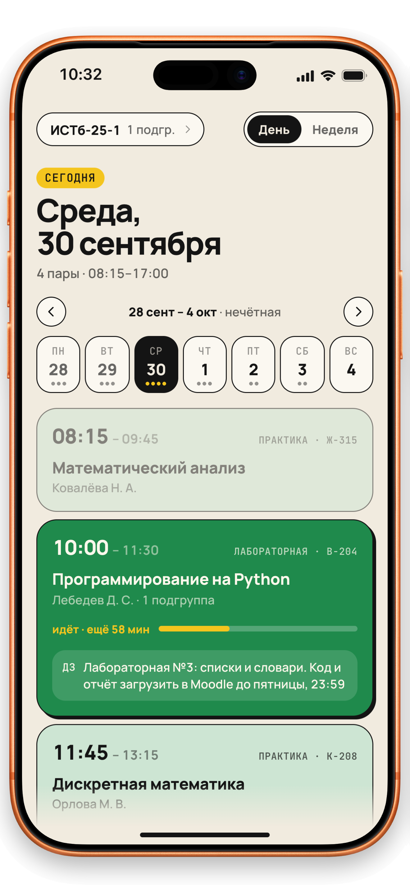
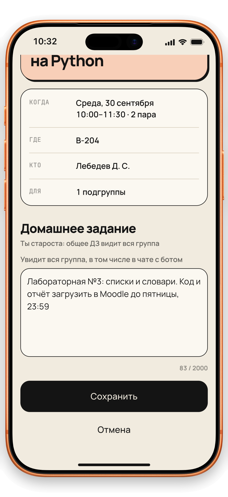
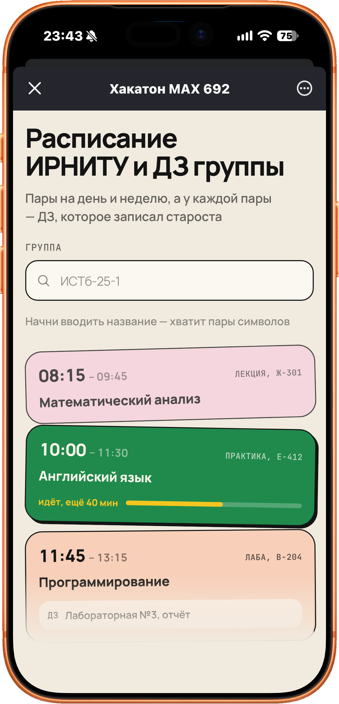
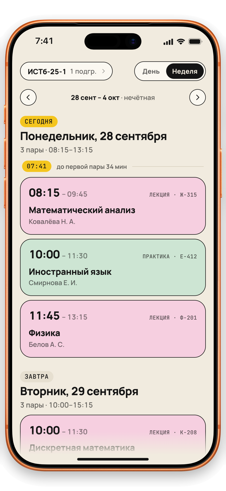
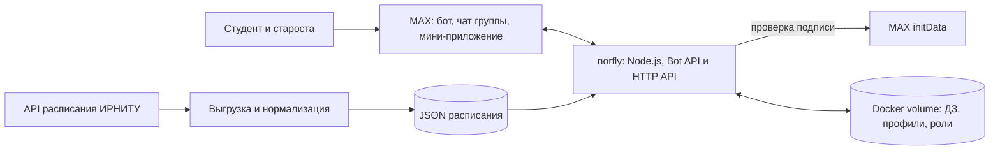

<h1 align="center">norfly</h1>

<p align="center">
  <strong>Расписание и домашние задания группы — прямо в MAX.</strong>
</p>

<p align="center">
  norfly — мини-приложение и бот для студентов ИРНИТУ. Оно связывает пару,
  аудиторию, домашнее задание и напоминание в одном привычном месте — в MAX.
</p>

<p align="center">
  <a href="https://max.ru/t692_hakaton_max_bot">
    
  </a>
  <a href="https://158-160-37-19.sslip.io">
    
  </a>
</p>

<p align="center">
  
  
  
  
</p>

<p align="center">
  <a href="#-назначение">Почему</a> ·
  <a href="#-возможности">Возможности</a> ·
  <a href="#-галерея">Галерея</a> ·
  <a href="#-пошаговый-сценарий-проверки">Проверка</a> ·
  <a href="#-состав-и-архитектура">Архитектура</a> ·
  <a href="#-запуск-через-docker">Docker</a>
</p>

<p align="center">
  
  
</p>

## 🤔 Назначение

В чате группы домашнее задание быстро теряется среди сообщений, а расписание открывается отдельно. norfly собирает их в один сценарий: студент открывает нужную пару и сразу видит, что, где и к какому сроку нужно сделать.

> **Одна связка:** `пара → аудитория → домашнее задание → напоминание`.

Проект рассчитан на студентов младших курсов ИРНИТУ и старост, которые собирают учебную информацию для группы. Расписание загружается из API ИРНИТУ, а ДЗ можно вести в чате группы и в мини-приложении MAX.

## 🎯 Возможности

- **Расписание на день и неделю** — группа, подгруппа, чётность недели, время, аудитория и преподаватель.
- **Текущая и ближайшая пара** — студент сразу понимает, что происходит сейчас и что будет дальше.
- **ДЗ рядом с парой** — общее задание видит вся группа в чате и приложении.
- **Личная версия ДЗ** — заметка конкретного студента не меняет общую запись.
- **Роли в групповом чате** — староста назначает редакторов и управляет доступом к ДЗ.
- **Планер и объявления** — личные задачи, сообщения старосты и напоминания настраиваются отдельно для каждого студента.
- **Контрольные** — экзамены и зачёты отображаются отдельным экраном с напоминаниями.
- **Переносы и замены** — бот замечает изменения в расписании и сообщает о новой паре, аудитории или преподавателе.
- **Напоминания об отсутствии** — студент сообщает об опоздании или пропуске, а староста получает обращение и отмечает его как принятое.
- **Профиль и приглашение** — группа, уведомления, язык RU/EN, тема интерфейса, удаление данных и ссылка для одногруппников.

## 🧭 Основной пользовательский сценарий

1. Студент открывает бота в MAX, находит `ИСТб-25-1` и выбирает подгруппу.
2. На «Главной» видит ближайшую пару, задачи и объявления; в «Расписании» переключает день и неделю.
3. Староста или редактор выбирает пару и добавляет общее домашнее задание.
4. Студент видит ДЗ рядом с парой, сохраняет личную версию и настраивает напоминание в планере.
5. Если планы меняются, студент сообщает об опоздании или отсутствии, а староста подтверждает обращение.

## 📱 Галерея

<table align="center">
  <tr>
    <td></td>
    <td></td>
  </tr>
  <tr>
    <td></td>
    <td></td>
  </tr>
</table>

<p align="center"><sub>Интерфейс показан на демонстрационных данных: даты, имена, пары и тексты заданий не являются данными реальных студентов.</sub></p>

## 🚀 Пошаговый сценарий проверки

Все значения для проверки (токены, ключ API, ссылка на демо-чат группы) указаны на первом слайде презентации.

**Основной сценарий: студент**

1. Откройте [бота norfly в MAX](https://max.ru/t692_hakaton_max_bot), нажмите «Начать» и кнопку «Открыть приложение».
2. Введите `истб 25`, выберите **ИСТб-25-1** и **1 подгруппу**.
   *Ожидается:* вкладка «Главная» показывает текущую или ближайшую пару с аудиторией и преподавателем, ниже — задачи и объявления.
3. Вкладка «Расписание»: переключите «День / Неделя», откройте карточку пары.
   *Ожидается:* время, аудитория, преподаватель и ДЗ группы к этой паре; внизу — время последнего обновления данных ИРНИТУ.
4. В карточке пары нажмите «Записать себе», напишите текст и сохраните.
   *Ожидается:* личная версия ДЗ видна только вам, общее ДЗ группы не меняется.
5. Вкладка «Планер» → «+ ДЗ»: выберите пару, текст и напоминание.
   *Ожидается:* задача появляется в планере и на «Главной», в назначенное время бот присылает напоминание.
6. Напишите боту `/today`, `/week`, `/homework`.
   *Ожидается:* те же пары и ДЗ, что в приложении.

**Групповой сценарий: староста и группа**

Вариант А — готовый демо-чат по ссылке с первого слайда: бот уже подключён, ДЗ заполнено.

Вариант Б — свой чат, 2 минуты:

1. Создайте чат в MAX, добавьте `@t692_hakaton_max_bot` и сделайте его администратором.
2. Напишите `/setup` и выберите **ИСТб-25-1**.
3. Напишите `/headman` и выберите себя из списка участников — вы станете старостой. Один раз нажмите «Начать» в личном чате с ботом, чтобы получать сообщения старосты.
4. Напишите `/add`, выберите пару и отправьте текст задания.
   *Ожидается:* ДЗ появляется в чате группы, у пары в мини-приложении и в `/homework` у всех участников.
5. В мини-приложении откройте вкладку «Староста» → «Объявления», опубликуйте объявление.
   *Ожидается:* сообщение в чате группы и в личном чате у каждого, кто запускал бота.
6. От имени студента на «Главной» нажмите «Опоздаю» и выберите причину.
   *Ожидается:* староста получает сообщение с кнопкой «Принято», во вкладке «Староста» появляется запись.

**Ошибки и восстановление**

- Группа не найдена: приложение показывает «Ничего не нашлось» и предлагает изменить запрос.
- API ИРНИТУ недоступен: показывается последнее сохранённое расписание и время его обновления.
- Приложение открыто вне MAX: расписание работает, для ДЗ приложение просит открыть его из бота.
- Кнопка без нужных прав в чате группы: бот отвечает коротким уведомлением и ничего не меняет.

## 💬 Команды MAX

| Сценарий | Команда |
|---|---|
| Расписание на сегодня, завтра или неделю | `/today`, `/tomorrow`, `/week` |
| ДЗ и личная версия задания | `/homework`, `/add` |
| Объявления старосты | `/news` |
| Сообщить об опоздании или отсутствии | `/absence` |
| Найти группу, преподавателя или аудиторию | `/find` |
| Настройки, язык и мои данные | `/settings` |
| Привязать чат к учебной группе | `/setup` |
| Управление группой и ролями | `/manage`, `/headman`, `/editor`, `/team`, `/access` |
| Справка и язык чата | `/help`, `/language` |

Все действия доступны и кнопками, команды вводить не обязательно.

## 🧩 Состав и архитектура



| Компонент | Путь | Роль |
|---|---|---|
| Мини-приложение | `webapp/` | React 19, TypeScript, `@maxhub/max-ui`, MAX Bridge. Главная, расписание, карточка пары, планер, профиль, вкладка старосты |
| Бот | `src/bot/` | Личный чат и чат группы: расписание, ДЗ, роли, объявления, опоздания |
| Уведомления | `src/services/notification-service.js`, `src/services/reminder-service.js` | Напоминания о парах, сводка в 20:00, новое ДЗ, переносы и замены |
| Клиент ИРНИТУ | `src/irnitu/`, `src/services/schedule-service.js` | Запросы к API, кэш, повторы, нормализация расписания |
| Выгрузка расписания | `scripts/export-schedule.js` | Ближайшие 2 недели — каждые 3 часа, весь семестр — раз в неделю |
| HTTP-сервер | `src/http/` | Раздаёт мини-приложение, `/health` и `/api/*` с проверкой подписи `initData` MAX |
| Хранилища | `src/storage/` | JSON-файлы с профилями и данными групповых чатов |
| Развёртывание | `Dockerfile`, `compose.yaml`, `scripts/docker-start.sh` | Один контейнер: мини-приложение, API, бот и выгрузка расписания |

Контракт API — [`openapi.yaml`](openapi.yaml), обязательные проверки — [`DATA-API.yaml`](DATA-API.yaml). Рабочий адрес API: `https://158-160-37-19.sslip.io`.

## 🛠️ Запуск через Docker

Нужен Docker с Compose v2.

```bash
cp .env.example .env
```

Заполните в `.env` `BOT_TOKEN` и `IRNITU_API_TOKEN` (значения на первом слайде презентации), затем одна команда запускает всё:

```bash
docker compose up --build
```

После запуска:

- бот начинает отвечать в MAX;
- мини-приложение открывается на http://localhost:3000;
- `http://localhost:3000/health` отвечает `{"status":"ok"}`;
- расписание семестра выгружается за 15–20 минут, затем ближайшие 2 недели обновляются каждые 3 часа.

Остановка и повторный запуск:

```bash
docker compose down        # остановить, данные остаются в томе norfly-data
docker compose up -d       # запустить снова в фоне
docker compose logs -f     # смотреть логи
```

Для одного токена бота должен работать один экземпляр: перед локальным запуском с рабочим токеном остановите другой процесс с этим же токеном.

## 🖥️ Параметры окружения

- Docker Engine с Docker Compose v2. Для разработки без Docker — Node.js 22 (минимум 20).
- Около 512 МБ свободной памяти и 1 ГБ места на диске: образ весит примерно 240 МБ, расписание семестра — около 90 МБ.
- Исходящий доступ в интернет к MAX Bot API (`platform-api2.max.ru`) и API ИРНИТУ (`schedule.istu.edu`).
- Часовой пояс контейнера — `Asia/Irkutsk`, задан в `Dockerfile`.
- Для кнопки мини-приложения внутри MAX нужен публичный HTTPS-адрес (`MINI_APP_URL`). Локально приложение открывается по HTTP в браузере.

## ⚙️ Переменные окружения

| Переменная | Обязательна | По умолчанию | Назначение |
|---|---|---|---|
| `BOT_TOKEN` | да | — | Токен бота MAX, выданный организаторами |
| `IRNITU_API_TOKEN` | да | — | Токен API расписания ИРНИТУ. Без него приложение откроется без расписания |
| `IRNITU_API_URL` | нет | `https://schedule.istu.edu/api/` | Адрес API ИРНИТУ |
| `IRNITU_TIMEOUT_MS` | нет | `6000` | Таймаут запроса к ИРНИТУ |
| `IRNITU_RETRIES` | нет | `1` | Число повторов запроса к ИРНИТУ |
| `CACHE_DIR` | нет | `./data/cache` | Кэш ответов ИРНИТУ |
| `PORT` | нет | `3000` | Порт HTTP-сервера в контейнере |
| `HOST_PORT` | нет | `3000` | Порт на машине для `docker compose` |
| `MINI_APP_URL` | нет | `https://158-160-37-19.sslip.io` | Публичный HTTPS-адрес мини-приложения |
| `MINI_APP_BUTTON` | нет | `app` | `app` — кнопка открывает мини-приложение внутри MAX с авторизацией; `link` — обычная ссылка (расписание работает, ДЗ — нет) |
| `API_ACCESS_KEY` | нет | — | Служебный ключ для проверки справочников и расписания через API |
| `INIT_DATA_MAX_AGE_SEC` | нет | `86400` | Срок действия подписи `initData` MAX |
| `DEV_USER_ID` | нет | — | Тестовый пользователь для локальной разработки, в `production` не действует |
| `EXPORT_INTERVAL_SEC` | нет | `10800` | Период обновления ближайших недель |
| `EXPORT_FULL_INTERVAL_SEC` | нет | `604800` | Период выгрузки всего семестра |
| `EXPORT_WEEKS` | нет | `2` | Сколько ближайших недель обновлять |

`.env` исключён из Git, в репозитории только `.env.example` без рабочих значений.

## 🔌 Порты

| Порт | Что |
|---|---|
| `3000` | HTTP-сервер: мини-приложение, `/health`, `/api/*` |

Бот подключается к MAX сам (long polling), входящие порты ему не нужны. На рабочем сервере HTTPS принимает обратный прокси и передаёт запросы на порт 3000.

## 📦 Зависимости

| Часть | Технологии | Где зафиксированы версии |
|---|---|---|
| Бот и API | Node.js 22 (минимум 20), `@maxhub/max-bot-api`, `dotenv` | `package-lock.json` |
| Мини-приложение | React 19, TypeScript, `@maxhub/max-ui`, Vite | `webapp/package-lock.json` |
| Интеграция с MAX | MAX Bridge (`https://st.max.ru/js/max-web-app.js`) | подключается платформой MAX |
| Запуск | Docker, Docker Compose v2 | `Dockerfile`, `compose.yaml` |

## 🌐 Внешние сервисы и интеграции

| Сервис | Для чего | Интеграция |
|---|---|---|
| MAX Bot API | Бот в личном чате и в чатах групп | реальная |
| MAX Bridge | Данные пользователя, кнопка «Назад», вибрация, параметр `startapp` | реальная |
| API расписания ИРНИТУ (`schedule.istu.edu`) | Группы, преподаватели, аудитории, пары | реальная, доступ предоставлен университетом |
| Yandex Cloud | HTTPS-хостинг бота, API и мини-приложения | реальная |

Сертификат `platform-api2.max.ru` выдан российским удостоверяющим центром Минцифры, поэтому в репозитории лежит публичный корневой сертификат `certs/russian_trusted_root_ca.pem`. В Docker он подключается через `NODE_EXTRA_CA_CERTS`. API ИРНИТУ нельзя воспроизвести внутри Docker: для проверки нужен токен с первого слайда.

## 🔐 Работа с данными

- **Расписание** — настоящее, из API ИРНИТУ. В приложении указано время последнего обновления.
- **Общее ДЗ** хранится для учебной группы: менять его могут староста и редакторы. **Личное ДЗ** видно только владельцу.
- **Профиль**: из данных MAX сохраняются только ID пользователя, имя и выбранная группа. Телефоны, сведения о здоровье и данные несовершеннолетних не собираются.
- **Сообщения об опоздании** не анонимные: староста видит имя студента, пару и причину. Они хранятся в данных группы.
- **Снимки расписания** для поиска переносов — только пары групп, без персональных данных.
- **Удаление аккаунта** (в профиле приложения или «Мои данные» в боте) стирает профиль, настройки, личное ДЗ и напоминания и снимает роли.
- API принимает только запросы с подписью `initData` MAX; служебный ключ открывает только справочники и расписание.
- Время пар и уведомлений считается по Иркутску (UTC+8).

## 🧪 Тестовые данные

- Расписание настоящее, моделированных данных в рабочей версии нет.
- Группа для проверки — **ИСТб-25-1**, 1 подгруппа. Записи ДЗ в ней добавлены студентами группы и командой.
- Для проверки группового сценария используйте демо-чат по ссылке с первого слайда или свой чат (вариант Б выше).
- `npm run dev` в папке `webapp/` без токена ИРНИТУ подставляет вымышленные группы `ДЕМО-25-1` и `ДЕМО-24-2`. Эти данные в рабочую сборку не попадают.

## 🧰 Разработка

```bash
npm ci && npm ci --prefix webapp
npm test                 # тесты сервера и сценариев бота
npm run dev:web          # мини-приложение на http://localhost:5173 с демо-данными
npm start                # бот и HTTP-сервер (нужен .env)
npm run export:schedule  # выгрузить ближайшие недели расписания
```

## ⚠️ Известные ограничения

- Одно ДЗ — до 2 000 символов; файлы и фото к ДЗ пока не прикрепляются.
- Переносы и замены проверяются раз в 3 часа, уведомление может прийти с такой задержкой. Дальние недели семестра обновляются раз в неделю.
- Для одного токена бота работает один экземпляр процесса.
- Начатый ввод в боте (текст ДЗ, причина отсутствия) хранится в памяти: после перезапуска его нужно повторить. Кнопки продолжают работать.
- Адрес мини-приложения для кнопки MAX задаётся на платформе MAX для партнёров, через Bot API его не поменять.
- Формы контроля по дисциплинам ИРНИТУ заранее не публикует, студент отмечает их сам.
- Минуты опоздания указывает студент; пропуск целой пары считается как 90 минут.
- В чате группы клиент MAX показывает команды с именем бота (`/start@t692_hakaton_max_bot`), это поведение клиента.

## 📈 План пилота

Следующий этап — шестинедельный пилот в группах ИРНИТУ. Пороги ниже — **гипотезы для проверки, а не достигнутые результаты**:

- не менее 60% подключённых групп назначают старосту в первую неделю;
- не менее 50% пар получают запись ДЗ;
- не менее 70% студентов подключённой группы открывают бота или приложение раз в неделю.

## 👥 Команда

<table align="center">
  <tr>
    <td align="center" width="33%">
      <br>
      <strong>Дмитрий Гавриленко</strong><br>
      <sub>Product-менеджер</sub>
    </td>
    <td align="center" width="33%">
      <br>
      <strong>Дмитрий Иванов</strong><br>
      <sub>Fullstack-разработчик</sub>
    </td>
    <td align="center" width="33%">
      <br>
      <strong>Вячеслав Какалевский</strong><br>
      <sub>UX/UI-дизайнер</sub>
    </td>
  </tr>
</table>

---

<p align="center"><sub>norfly · Хакатон MAX 2026 · образовательные решения</sub></p>
